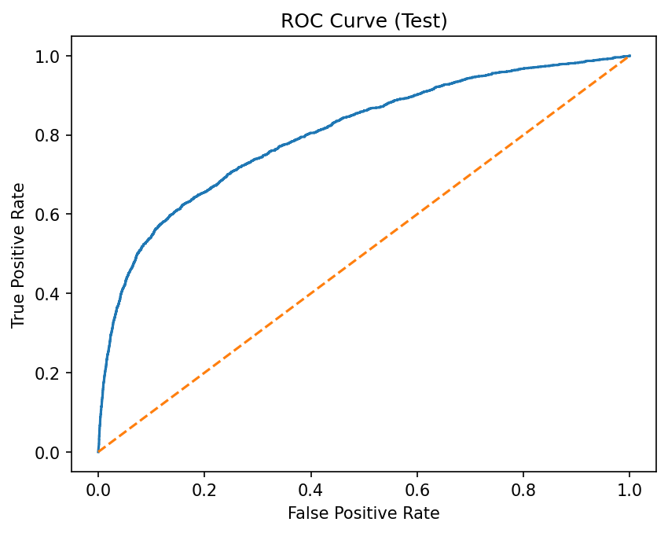
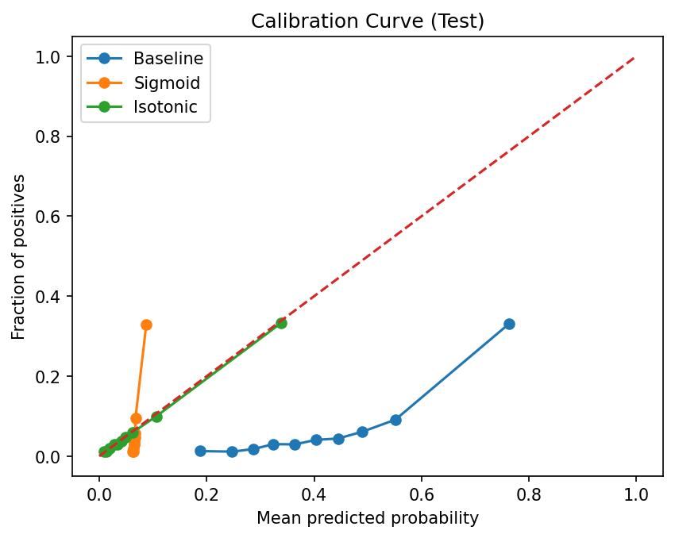
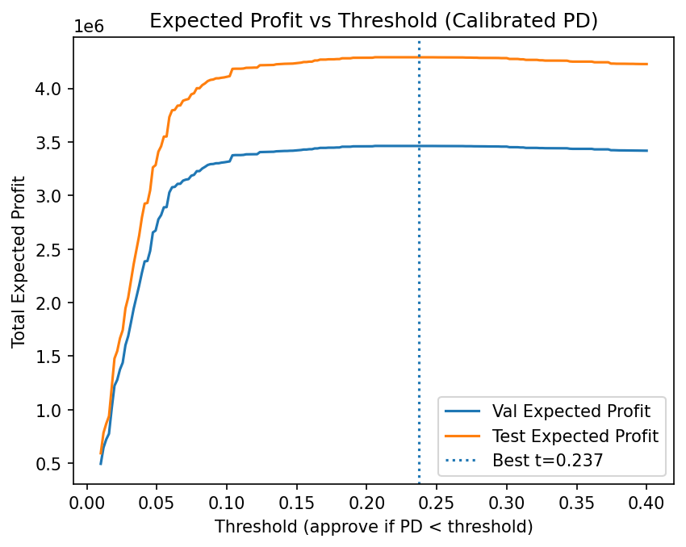
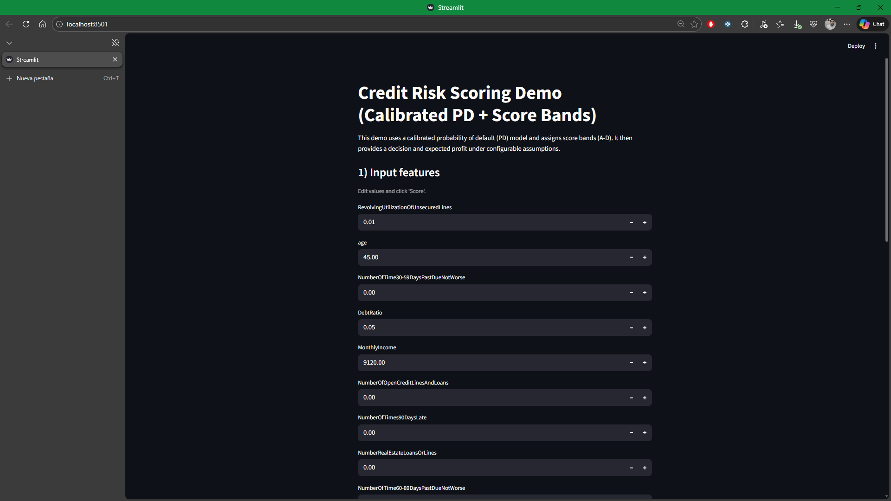
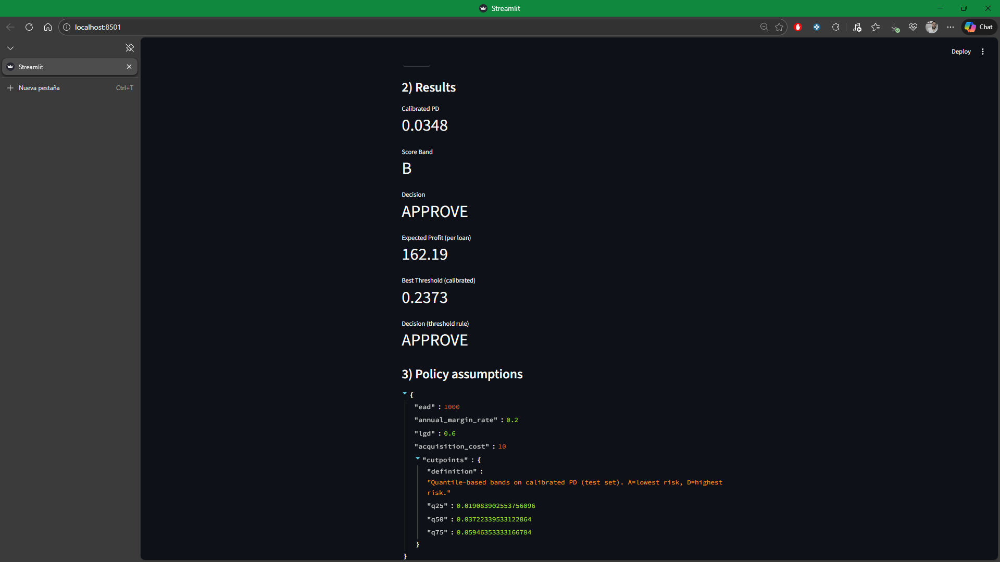

# Credit Risk Scoring (End-to-End)
Probability of Default (PD) model with calibration, risk segmentation (score bands), and profit-based credit policy simulation. Includes a Streamlit scoring demo.

## What this project does
- Trains a **PD model** (baseline logistic regression with preprocessing).
- Calibrates probabilities using **Sigmoid** and **Isotonic** calibration.
- Builds **Score Bands A–D** to segment risk and quantify business impact.
- Simulates a **credit policy** to maximize expected profit under configurable assumptions.
- Provides a **Streamlit app** to score a single applicant: PD, band, decision, and expected profit.

## Dataset
OpenML “Give Me Some Credit” (target: financial distress within 2 years). Data is downloaded via OpenML API.

## Results
### Baseline model (Test)
- ROC-AUC: **0.8030**
- PR-AUC: **0.3253**
- KS: **0.4646**
- Base rate (default): **0.0670**

## Key Figures

### ROC Curve (Test)


### Calibration Curve (Test)


### Expected Profit vs Threshold (Calibrated PD)



### Calibration (Test)
Baseline probabilities were heavily miscalibrated (mean PD ~0.406 vs base rate ~0.067).  
After calibration:
- **Isotonic** (recommended)
  - Brier: **0.0524**
  - mean predicted PD: **0.0690**
- Sigmoid
  - Brier: 0.0621

Artifacts:
- `reports/figures/calibration_curve_test.png`

### Risk segmentation: Score Bands (Test, calibrated PD)
Quantile-based bands on calibrated PD (A=lowest risk → D=highest risk):

| Band | Share | Avg PD | Realized Default Rate | Expected Profit / Loan |
|------|-------|--------|------------------------|------------------------|
| A    | 27.37% | 1.28% | 1.35% | 179.76 |
| B    | 22.92% | 2.94% | 2.83% | 166.47 |
| C    | 24.73% | 4.76% | 4.60% | 151.94 |
| D    | 24.98% | 18.83% | 18.19% | 39.38 |

Outputs:
- `reports/score_bands_test.csv`
- `reports/score_band_cutpoints.json`

### Profit-based policy (Calibrated PD, validation-chosen threshold)
Assumptions in `policy_config.json`:
- EAD=1000, margin=20%/year, LGD=60%, acquisition_cost=10

Best threshold chosen on validation to maximize expected profit:
- Best PD threshold: **0.2373**
- Test approval rate: **0.9321**
- Test expected profit total: **4,290,849.74**
- Test realized profit total: **4,332,110.00**

Figures:
- `reports/figures/profit_vs_threshold_calibrated.png`
- `reports/figures/approval_rate_vs_threshold_calibrated.png`

## Streamlit Results

### Credit Risk Scoring DEMO


### Results on Credit Risk Scoring DEMO


## Streamlit Community Cloud
[link](https://credit-risk-end-to-end-kq2hham6gxeau8omrwzwju.streamlit.app/)

## How to run (Windows PowerShell)

```powershell
python -m venv .venv
.venv\Scripts\activate
pip install -r requirements.txt

$env:PYTHONPATH="."

python -m src.data.ingest
python -m src.data.validate

python -m src.models.train_baseline
python -m src.models.calibrate
python -m src.models.score_bands
python -m src.models.policy_simulation_calibrated

streamlit run src\app\streamlit_app.py


